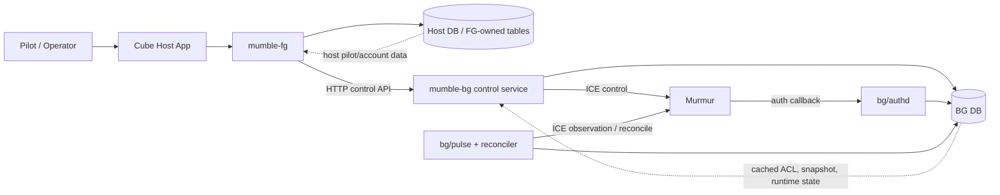
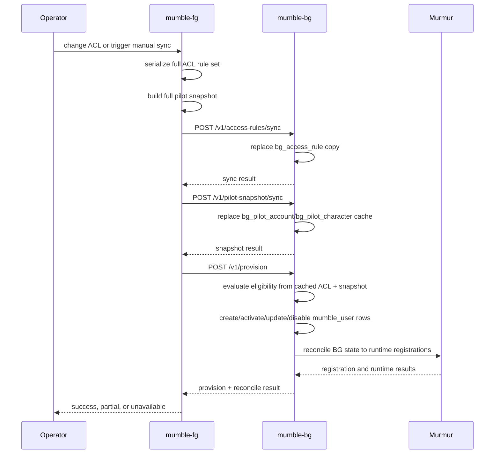
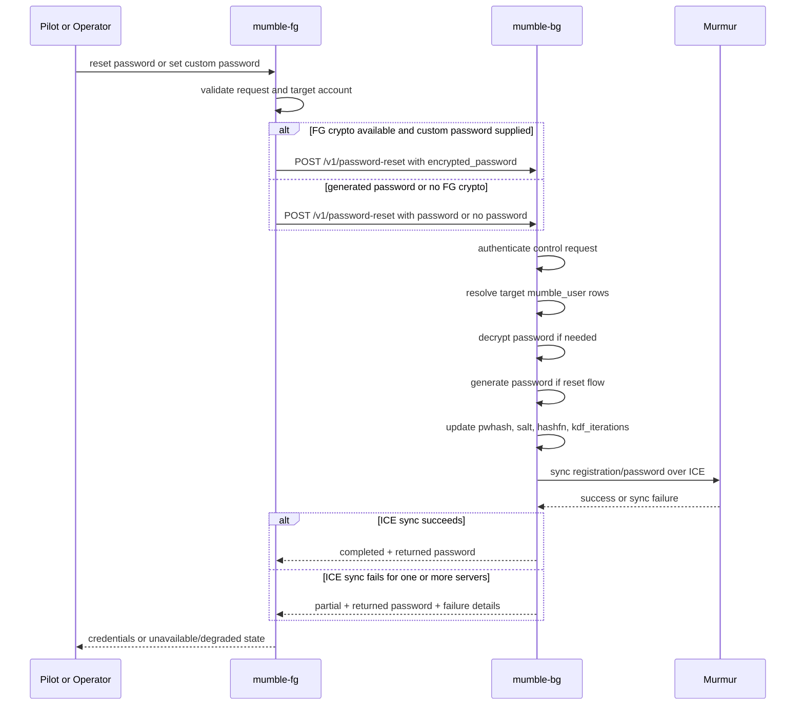
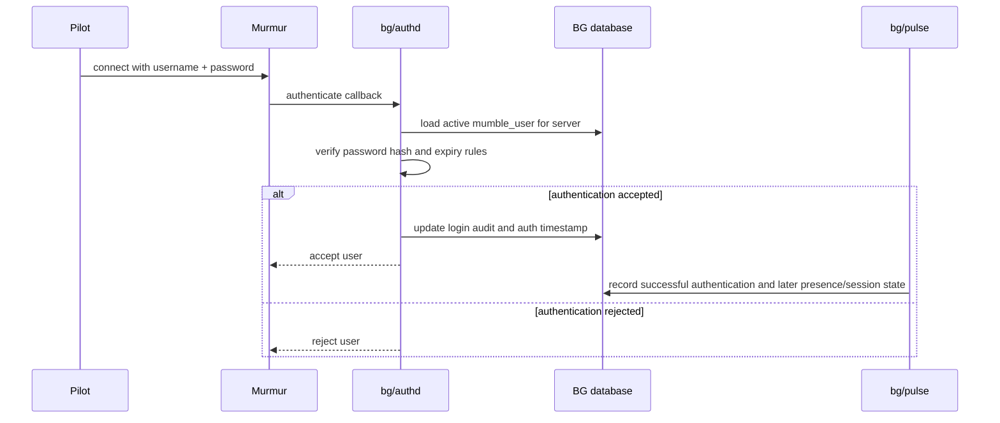

# Mumble FG/BG System Design (After-the-Fact)

Verified: `mumble-fg` `main` version `0.3.7.dev1` on `2026-04-24`.

## Scope

This document describes the current FG/BG Mumble split as implemented across:

- `mumble-fg`
- `mumble-bg`
- `cube` where it acts as the host application

It is an after-the-fact design document, not a greenfield specification. It prioritizes current code and active docs over archived notes.

## 1. System Summary

The system is intentionally split into two services with a narrow contract:

- `mumble-fg` is the host-facing side.
  - It owns operator UI, profile UI, ACL administration, host integration, and host-data reads.
  - In Cube, it mounts under `mumble-ui/` and contributes a profile panel plus periodic tasks.
- `mumble-bg` is the runtime-facing side.
  - It owns runtime state, Murmur registration state, password material, ICE communication, authenticator behavior, reconciliation, and presence/session tracking.
- `Murmur` remains the voice server runtime.
  - BG talks to it through ICE for registration, membership, inventory, authentication hookup, and session observation.

The critical architectural rule is that FG reads host data and BG reads runtime data. FG and BG exchange state only through explicit HTTP control APIs and shared JSON payload contracts.

## 2. Design Goals

The implemented split serves four goals:

- isolate Murmur and ICE operations from the host application database and UI
- keep host-specific account and pilot lookups on the FG side
- make BG a reusable runtime service that can manage zero, one, or many Murmur servers
- avoid direct cross-repo ORM coupling between FG and BG

## 3. Ownership Boundaries

### FG owns

- ACL CRUD and ACL audit UI
- profile-panel rendering for pilots
- host-side pilot/account reads
- host-side group mapping UI and state
- temp-link management UI
- control client calls into BG
- host integration hooks for Cube-like apps

### BG owns

- cached copies of ACL rules and pilot snapshot data received from FG
- Murmur server inventory and runtime registration state
- password hashing state and generated plaintext password lifecycle during reset/set flows
- ICE integration and reconciler logic
- authenticator daemon behavior
- live session/presence state
- BG-side audit rows
- control-key bootstrap/rotation/export logic

### Explicitly not allowed by design

- FG does not read BG tables directly.
- BG does not read Cube or other host pilot/core tables directly.
- BG does not write host-owned tables.
- Long-lived shared ORM behavior across repos is treated as a defect.

## 4. Process Topology

### FG process roles

FG runs as a Django optional app inside the host application.

Primary surfaces:

- profile panel and pilot self-service password actions
- operator controls for activation, deactivation, password reset/set, contract sync, ACL sync, group mapping, and temp links
- periodic tasks:
  - ACL sync every 10 minutes
  - group sync every 3 minutes

### BG process roles

BG is a Django-backed service with multiple roles:

- HTTP control service in `bg/control.py`
- ICE authenticator daemon in `bg/authd/service.py`
- pulse/presence collector in `bg/pulse/service.py`
- reconciler in `bg/pulse/reconciler.py`
- provisioning logic in `bg/provisioner.py`

### Murmur roles

Murmur provides:

- registered-user storage and runtime connection endpoint
- ICE control plane
- live channel, group, ACL, and session state

## 5. Identity Model

The stable cross-system account key is `pkid`.

FG builds an account-oriented pilot snapshot keyed by `pkid`. Each account contains:

- `account_username`
- `display_name`
- `pilot_data_hash`
- one or more characters
- exactly one main character after normalization

Each character record contains:

- `character_id`
- `character_name`
- `corporation_id`
- `corporation_name`
- `alliance_id`
- `alliance_name`
- `is_main`

Operational identity rules:

- policy evaluation is account-wide, not character-row local
- pilot-facing names are human-readable display names, not `pkid`
- the login username contract for runtime registration is FG `account_username`
- Murmur registration rows are per `(server, pkid)`

## 6. Permissions Model

### 6.1 ACL policy permissions

ACL policy is FG-owned and then copied to BG.

Supported FG/BG ACL entity types:

- `alliance`
- `corporation`
- `pilot`

Rule fields:

- `entity_id`
- `entity_type`
- `deny`
- `acl_admin`
- `note`
- `created_by`

Effective precedence is:

1. pilot allow or deny
2. corporation deny
3. alliance allow

Additional semantics:

- unlisted alliances are implicitly denied
- deny evaluation applies across the whole account, including alts
- a deny on any alt blocks the account unless a more specific allow exists
- `acl_admin` is valid only for pilot rules
- denied pilots cannot remain `acl_admin`
- pilots with corporation or alliance deny cannot remain effective admin

### 6.2 FG application permissions

FG separates viewing/changing ACLs from admin elevation and other operator functions.

FG model permissions include:

- `manage_acl_admin`
- `view_acl_admin_my_corp`
- `view_acl_admin_my_alliance`
- `view_acl_admin_all`
- `view_group_mapping`
- `change_group_mapping`
- `add_group_mapping`
- `delete_group_mapping`
- `view_temp_links`
- `change_temp_links`
- `add_temp_links`
- `delete_temp_links`

Important application rule:

- `is_staff` by itself is not the core authorization model for Mumble operations
- `is_superuser` is still used as an operator bypass in several FG and BG surfaces

### 6.3 BG control authorization

BG control endpoints authenticate FG with a shared secret model.

Accepted control auth sources, in effective order:

- rotating encrypted control-key entries
- legacy DB `shared_secret`
- bootstrap env secret `BG_PSK`
- open mode only if no secret is configured at all

Headers accepted by BG include:

- `X-FGBG-PSK`
- `X-Murmur-Control-PSK`
- bearer token in `Authorization`
- optional key id in `X-BG-KEY-ID`

FG prefers the rotating keyring and falls back to `BG_PSK` only for bootstrap or break-glass behavior.

### 6.4 Murmur runtime permissions

BG projects policy into Murmur runtime state using:

- `is_mumble_admin`
- `groups`
- active/inactive registration state

Runtime admin membership is synchronized live over ICE and can also be reconciled from BG state.

## 7. Data Model

### 7.1 FG persisted data

FG-owned persistent state includes:

- `fg_access_rule`
  - source of truth for ACL policy
- `fg_access_rule_audit`
  - append-only audit log for ACL changes and sync attempts
- `fg_pilot_snapshot_hash`
  - per-account hash cache to detect snapshot changes
- `fg_cube_group_mapping`
  - global Cube-group to Murmur-group mapping intent
- `fg_ignored_cube_group`
  - ignored Cube groups
- `fg_ignored_murmur_group`
  - ignored Murmur groups
- `fg_murmur_inventory_snapshot`
  - imported BG inventory snapshots for UI rendering and divergence analysis
- `fg_temp_link`
  - temp-link definitions exposed publicly through FG and redeemed in BG
- `fg_control_channel_key_entry`
  - FG-held encrypted copy of BG rotating control secrets

FG also resolves a host-provided `MumbleUser` model through adapter lookup rather than direct import coupling.

### 7.2 BG persisted data

BG-owned persistent state includes:

- `mumble_server`
  - one row per managed Murmur target, including address, ICE host/port, secret, virtual server id, and optional TLS file paths
- `murmur_server_inventory_snapshot`
  - last fetched per-server channel/group/ACL inventory payload and freshness metadata
- `mumble_user`
  - per-user per-server runtime registration state
- `mumble_session`
  - live and historical presence/session state observed from Murmur
- `bg_access_rule`
  - BG’s operational copy of FG ACL rules
- `bg_access_rule_audit`
  - immutable sync audit for effective ACL changes
- `bg_eve_object`
  - immutable EVE object cache for name/ticker resolution
- `bg_pilot_account`
  - cached FG account snapshot rows by `pkid`
- `bg_pilot_character`
  - cached FG character rows under each account
- `bg_pilot_snapshot_audit`
  - snapshot sync audit summaries
- `control_channel_key`
  - legacy/shared control secret row
- `control_channel_key_entry`
  - rotating encrypted control secrets
- `bg_audit`
  - append-only audit for pilot create/enable/disable/password/login/display-name events

### 7.3 Notable `mumble_user` fields

A BG runtime registration row stores:

- host identity: `user_id` (`pkid`)
- target server: `server_id`
- contract metadata: `evepilot_id`, `corporation_id`, `alliance_id`
- Murmur registration id: `mumble_userid`
- login/display data: `username`, `display_name`
- password state: `pwhash`, `hashfn`, `pw_salt`, `kdf_iterations`
- runtime metadata: `groups`, `is_mumble_admin`, `is_active`
- temporary access fields: `is_temporary`, `temporary_link_token`, `temporary_expires_at`
- authentication/presence timestamps: `last_authenticated`, `last_connected`, `last_disconnected`, `last_seen`, `last_spoke`
- client cert hash: `certhash`

### 7.4 Shared transport data

FG and BG share a normalized pilot snapshot contract from `fgbg_common.snapshot`.

The snapshot payload contains:

- `generated_at`
- `accounts[]`
  - `pkid`
  - `account_username`
  - `display_name`
  - `pilot_data_hash`
  - `characters[]`

`pilot_data_hash` is an md5 over normalized account identity and character data. It is used as a change detector, not as a security primitive.

## 8. Functional Responsibilities

### 8.1 FG functions

FG performs five categories of work.

#### Policy administration

- manage ACL rows
- render eligible and blocked account views from host-side character data
- audit ACL mutations
- push full ACL state to BG

#### Pilot snapshot export

- read host pilot/account data
- normalize account usernames and display names
- include main and alt characters
- compute `pilot_data_hash`
- send full snapshot to BG as part of sync/provision flows

#### User-facing profile actions

- show per-pilot Mumble panel only when the user is eligible
- show one or more available servers returned by BG
- trigger password reset or custom password set through BG
- show returned credentials to the pilot

#### Operator runtime actions

- activate or deactivate registrations
- toggle runtime admin state
- sync contract metadata
- trigger manual ACL sync
- manage temp links

#### Group mapping and host integration

- maintain global Cube-to-Murmur group mapping intent
- import BG per-server Murmur inventory snapshots
- compute effective mappings and suppressed mappings locally in FG
- expose Cube extension hooks for URL mounting, profile panels, and periodic tasks

### 8.2 BG functions

BG performs six categories of work.

#### Control API handling

- authenticate FG requests
- validate request envelopes and payloads
- expose sync, provision, registration, inventory, and health endpoints

#### Cached-state ownership

- store FG ACL copies
- store FG pilot snapshot copies
- store EVE object dictionary rows

#### Eligibility and provisioning

- compute account eligibility from cached ACL and snapshot data
- determine runtime admin accounts from pilot-level `acl_admin`
- create, activate, update, or disable `mumble_user` rows
- preserve disabled rows rather than deleting them

#### Password and registration management

- generate and hash passwords
- update BG password state
- push registration/password changes to Murmur over ICE
- support password reset even when authd is not the live login path

#### Runtime synchronization

- synchronize admin group membership live
- reconcile BG registration state against Murmur state
- collect live session and speaking presence
- expose server inventory snapshots

#### Temporary guest access

- redeem temp links into temporary guest registrations
- provision expiration-bounded guest accounts
- revoke temp-link registrations

## 9. Communications and APIs

### 9.1 FG to BG control channel

FG calls BG over HTTP JSON.

Request envelope shape:

- `request_id`
- `requested_by`
- `timestamp`
- `payload`

Typical status values in BG responses:

- `completed`
- `partial`
- `accepted`
- `not_found`
- `failed`
- `rejected`

FG applies a handshake-failure throttle so repeated auth or reachability failures do not hammer BG continuously.

### 9.2 Main BG endpoints

Current control endpoints include:

- `POST /v1/registrations/sync`
- `POST /v1/registrations/contract-sync`
- `POST /v1/registrations/disable`
- `POST /v1/admin-membership/sync`
- `POST /v1/password-reset`
- `POST /v1/temp-links/redeem`
- `POST /v1/temp-links/revoke`
- `POST /v1/control-key/bootstrap`
- `POST /v1/control-key/rotate`
- `GET /v1/control-key/status`
- `POST /v1/control-keys/export`
- `GET /v1/pilots/<pkid>`
- `GET /v1/registrations`
- `GET /v1/health`
- `GET /v1/servers`
- `GET /v1/servers/<server_key>/inventory`
- `POST /v1/access-rules/sync`
- `GET /v1/access-rules`
- `POST /v1/pilot-snapshot/sync`
- `POST /v1/eve-objects/sync`
- `GET /v1/eve-objects`
- `POST /v1/provision`
- `GET /v1/public-key`

### 9.3 Sync sequence

The implemented synchronization model is full-copy, not row-delta.

Typical ACL-driven flow:

1. FG serializes the full ACL rule set.
2. FG serializes the full pilot snapshot.
3. FG sends ACL sync to BG.
4. FG sends snapshot/provision data when needed.
5. BG replaces its cached operational copies.
6. BG provisions runtime rows from the cached copies.
7. BG reconciles BG state to Murmur state.

Important implementation detail:

- BG currently always reconciles after `POST /v1/provision`, even if the incoming `reconcile` flag is false. The flag is effectively accepted for compatibility, but reconciliation is treated as mandatory on the BG side.

### 9.4 BG to Murmur communications

BG communicates with Murmur through ICE for:

- registration create/update/disable
- admin membership and group synchronization
- inventory fetches
- authenticator registration
- live session inspection

The authenticator daemon registers scoped authenticators per active BG `mumble_server` row.

### 9.5 Murmur to BG communications

Murmur calls BG-authored logic in two ways:

- auth callbacks into the BG authenticator path for username/password validation
- runtime session and user-state observation through pulse/reconciler logic

### 9.6 FG to host application communications

FG communicates with the host app by in-process Django integration:

- reading host user, pilot, and EVE models
- contributing URLs and profile panels
- resolving host-specific adapters rather than hard-coding Cube imports everywhere

In Cube specifically, `fg/cube_extension.py` is the integration hook.

## 10. Authentication and Password Handling

### Control channel auth

- FG authenticates to BG with a PSK model.
- Rotating keys are preferred.
- `BG_PSK` remains the bootstrap or break-glass secret.

### Password generation and storage

BG stores Murmur password records using:

- `murmur-pbkdf2-sha384`
- 48-byte derived key length
- 8-byte salt
- minimum KDF iterations of `16000`

### Password reset/set flow

- FG validates pilot input and supported characters.
- FG can encrypt a requested plaintext password with BG’s public key.
- BG decrypts it if BG crypto is configured.
- BG updates its own password record.
- FG profile/self-service password actions currently use the user-by-`pkid` reset flow, which asks BG to skip Murmur sqlite sync.
- In that flow, BG stores the password hash locally and returns `completed` with Murmur sync skipped.
- Other BG password/reset paths can still attempt Murmur registration sync over ICE and may return `partial` on ICE failure.

Important semantic rule:

- BG is the source of truth for runtime password material.
- When ICE authd is active, BG authd is the authoritative login path; Murmur sqlite registration state is fallback or compatibility state.

## 11. Temp-Link Flow

Temp links are split intentionally.

FG owns:

- operator creation and deletion of links
- local temp-link metadata and public landing page

BG owns:

- actual guest registration redemption
- password creation
- temporary registration state and expiry enforcement
- revoke behavior against runtime state

Flow:

1. operator creates temp link in FG
2. pilot opens public FG URL and enters a display name
3. FG calls BG `/v1/temp-links/redeem`
4. BG creates or updates a temporary runtime registration
5. FG increments link usage locally and shows credentials
6. disabling or deleting the link triggers BG revoke

## 12. Inventory and Group Mapping

Inventory ownership is split cleanly.

BG owns:

- per-server Murmur inventory fetch
- freshness metadata
- no cross-server merge behavior

FG owns:

- imported snapshot storage for UI purposes
- global Cube-group to Murmur-group mapping intent
- ignore state for Cube groups and Murmur groups
- divergence rendering and suppression semantics

This means BG is a per-server bridge, while FG is the place where cross-server comparison and operator intent are modeled.

## 13. Failure Semantics

The system is designed to degrade rather than silently fall back across the boundary.

Implemented behavior includes:

- BG unreachable from FG: operation is unavailable; FG does not fall back to direct BG DB access
- control auth failure: FG throttles retries temporarily
- password stored in BG but Murmur sync failed: BG returns partial success semantics
- no ICE endpoints configured: BG control remains reachable, but reconciliation/inventory/authd work degrades
- per-server ICE outage in multi-server mode: BG can continue working with other servers and surface degraded status

## 14. Security Model

### Boundary security

- host data stays on FG
- runtime secrets stay on BG
- control auth uses PSK and optional rotating keys
- password plaintext is not stored long-term as the canonical value

### Key management

- BG can expose a public key for FG password encryption
- rotating control-channel secrets are stored encrypted at rest in both systems
- BG also supports TLS material per ICE endpoint

### ICE security

Current active docs require TLS-enabled ICE when configured:

- per-server TLS cert, key, and CA paths can be stored on `mumble_server`
- Murmur must load the IceSSL plugin correctly
- BG still uses per-server ICE secrets in addition to TLS

## 15. Cube-Specific Integration Notes

Cube is the main host assumed by the current FG implementation.

Cube-specific behavior includes:

- extension-based URL mounting under `mumble-ui/`
- profile panel contribution through host panel services
- periodic task registration through the extension hook
- host-side reads of account, character, corporation, and alliance data used to build the FG pilot snapshot and display names

The FG code still tries to preserve host abstraction through adapter lookup, but Cube is the concrete host context exercised by the present implementation.

## 16. Current Architectural Character

The architecture is not event-driven and not fully decoupled. It is a pragmatic control-plane split with these characteristics:

- full-copy sync for policy and pilot identity
- BG-owned runtime materialization from FG-owned source data
- HTTP as the hard boundary between host-side and runtime-side concerns
- Murmur managed as a subordinate runtime behind BG
- operator intent stored in FG, operational truth stored in BG, live truth observed from Murmur

## 17. Practical Invariants

The code currently depends on these invariants remaining true:

- `pkid` is stable across FG and BG
- FG remains the only source of host pilot/account truth
- BG remains the only source of runtime password and registration truth
- ACL sync is full-table replacement on BG
- pilot snapshot sync is full-copy replacement on BG
- disabled users remain in BG/Murmur state rather than being deleted
- `acl_admin` never implies allow by itself
- server labels shown to pilots come from BG server metadata, not raw endpoints where labels exist

## 18. Known Tensions and Design Debt

These are visible in the current implementation and docs.

- Some repository-level index docs still point at missing or archived files.
- The documented `reconcile` input on BG provision is no longer a real behavior toggle; BG always reconciles after provisioning.
- The system still carries compatibility paths for legacy shared secrets and older env names.
- FG and BG are boundary-clean at runtime, but both still duplicate some eligibility and snapshot helper logic.
- `pilot_data_hash` uses md5 because it is a change detector, but the name can be misread as a security feature.

## 19. Sequence Diagrams

### 19.0 Component Diagram

### 19.1 ACL Sync and Provision/Reconcile

### 19.2 Password Reset or Set Password

### 19.3 Pilot Login Through BG Authenticator

## 20. Source Basis

This document was derived primarily from active sources in:

- `mumble-fg/README.md`
- `mumble-fg/docs/design_spec.md`
- `mumble-fg/docs/group_mapping_v1_plan.md`
- `mumble-fg/fg/*.py`
- `mumble-bg/README.md`
- `mumble-bg/docs/design_spec.md`
- `mumble-bg/docs/securing-ice-protocol.md`
- `mumble-bg/bg/*.py`
- `repository/docs/fg-bg-status.md`

Archived `repository/history/*` and `repository/mumble-*/history/*` material was not treated as authoritative.
